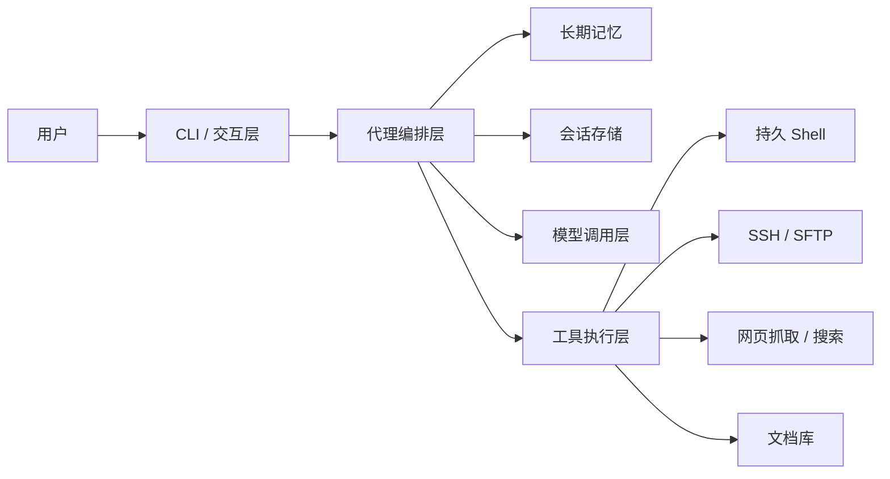

# lumin-chat

lumin-chat 是一个面向 Linux 终端的中文智能代理，支持多轮对话、Shell 执行、SSH 远程操作、网页访问、远程文档库读取、RPM 打包部署，以及**会话级长期记忆**。

本项目当前已完成：

- 中文终端输入增强
- 会话长期记忆
- SSH 远程命令与远程文件管理
- Web 抓取与搜索
- RPM 打包与安装
- tl3588 测试板部署与回归测试

---

## 1. 核心特性

### 1.1 终端交互

- 优先支持中文输入输出
- 使用 `prompt_toolkit` 改善 Backspace、Delete、方向键和历史记录体验
- 支持交互模式 `chat` 与单次模式 `ask`
- 支持从 JSON 文件批量提交任务并自动生成逐任务报告

### 1.2 会话级长期记忆

- 每个会话自动创建独立长期记忆
- 自动沉淀用户偏好、固定约束和历史结论
- 下一轮提问时按当前问题召回相关长期记忆
- 会话恢复后长期记忆仍可继续使用
- 新建会话后会切换到新的长期记忆空间，旧会话记忆不会被删除
- 切换回旧会话后，可继续召回该会话很久以前的历史记录

### 1.3 丰富工具能力

- 本地 Shell 与文件操作
- SSH 远程命令执行
- SSH 远程文件上传、下载、读写、目录管理
- 远程知识库文档读取
- 网页抓取与公开搜索

### 1.4 发布与部署

- 支持一键构建 RPM
- 支持本地构建后部署
- 支持先在构建服务器编译再部署
- 支持自动部署到 tl3588 并执行测试

---

## 2. 整体架构



更详细设计见 [docs/design.md](docs/design.md)。

---

## 3. 目录说明

```text
main.py                     程序入口
config.json                 默认配置
deploy.py                   构建、部署、测试入口
README.md                   发布说明
src/
  agent.py                  代理编排
  app.py                    CLI 与交互循环
  memory_store.py           长期记忆
  session_store.py          会话持久化
  toolkit.py                工具执行器
  ssh_client.py             SSH/SFTP 封装
  web_tools.py              网页抓取与搜索
scripts/
  build_rpm.py              RPM 构建脚本
  build_rpm.sh              RPM 一键打包脚本
  smoke_test.py             本地/远端冒烟测试
  docker_ubuntu_test.py     Docker Ubuntu 非交互测试
  remote_bootstrap.sh       源码部署初始化脚本
docs/
  design.md                 中文设计文档
  rpm_packaging.md          RPM 补充说明
reports/
  docker_ubuntu_test_report.md   最近一次测试报告
```

---

## 4. 环境要求

- Linux
- Python 3.10+
- `rpmbuild`（如需构建 RPM）
- 目标板支持 `rpm`
- 如需远程功能，需能使用 SSH 连接目标主机

---

## 5. 安装依赖

推荐使用虚拟环境：

```bash
python3 -m venv .venv
.venv/bin/python -m ensurepip --upgrade
.venv/bin/python -m pip install -r requirements.txt
```

---

## 6. 运行方式

### 6.1 交互模式

```bash
python3 main.py chat
```

### 6.2 单次请求模式

```bash
python3 main.py ask "检查当前目录结构"
```

### 6.3 常用参数

```bash
python3 main.py --help
```

支持：

- `--config`
- `--model-level`
- `--approval-mode`
- `--command-policy-mode`
- `--workdir`
- `--session`

### 6.4 批量任务模式

支持通过 JSON 文件顺序执行多个任务：

```json
[
  {
    "task": "检查当前目录结构",
    "new_session": true
  },
  {
    "task": "查看当前系统的内存使用情况",
    "new_session": false
  }
]
```

执行方式：

```bash
python3 main.py batch tasks.json
python3 main.py batch tasks.json --report-dir ~/lumin-report
```

规则说明：

- `new_session` 未设置时默认是 `true`
- `true` 表示该任务开始前创建新会话
- `false` 表示继续使用当前批处理中的上一个会话
- 单个任务失败不会中断后续任务执行
- 默认报告目录为 `~/lumin-report`

---

## 7. Slash Command

交互模式下支持：

- `/help`
- `/new-session`
- `/sessions [n]`
- `/switch-session <session_id|path>`
- `/model <level>`
- `/approval <prompt|auto|read-only>`
- `/policy <blacklist|whitelist>`
- `/cd <path>`
- `/cwd`
- `/session`
- `/shell`
- `/memory [query]`
- `/restart-shell`
- `/reset`
- `/exit`

其中 `/memory [query]` 可查看当前会话已经沉淀的长期记忆。

长期记忆的边界说明：

- 长期记忆**针对整个会话**，不是针对单个任务。
- 新建会话时，不会清空旧会话记忆，而是创建新的独立记忆空间。
- 切换会话时，会同时切换到对应会话的长期记忆。
- 召回时只注入与当前问题相关的历史片段，避免无关信息污染回答。

---

## 8. 长期记忆说明

长期记忆采用**会话级 SQLite 存储**：

- 会话文件：`~/.lumin-chat/sessions/`
- 长期记忆库：`~/.lumin-chat/memory/memory.db`

### 8.1 记忆内容

长期记忆包含两类：

1. **稳定偏好/事实**
   - 例如默认测试板、部署方式、输出偏好、路径约束。
2. **历史记忆片段**
   - 来自每一轮输入输出沉淀的标题、摘要和内容。

### 8.2 工作方式


---

## 9. 配置优先级

配置优先级如下：

1. 项目根目录 `config.json`
2. 系统配置 `/etc/lumin-chat/config.json`（优先级更高）
3. 默认配置兜底

安装到系统后，会优先使用：

- `/etc/lumin-chat/config.json`

发布态 `config.json` 已移除真实密钥与账户信息，需要用户自行填写，或通过环境变量注入模型 API Key。

推荐优先使用环境变量：

- `LUMIN_CHAT_LEVEL1_API_KEY`
- `LUMIN_CHAT_LEVEL2_API_KEY`
- `LUMIN_CHAT_LEVEL3_API_KEY`
- `LUMIN_CHAT_LEVEL4_API_KEY`
- `LUMIN_CHAT_LEVEL5_API_KEY`

---

## 10. RPM 打包

### 10.1 本地构建 RPM

```bash
python3 scripts/build_rpm.py
```

或：

```bash
bash scripts/build_rpm.sh
```

默认输出目录：

- `dist/rpm/`

### 10.2 RPM 安装布局

- 程序目录：`/var/lib/lumin-chat`
- 配置文件：`/etc/lumin-chat/config.json`
- 启动命令：`/usr/bin/lumin-chat`

安装成功后可直接执行：

```bash
lumin-chat --help
```

---

## 11. 部署到测试板

### 11.1 直接部署到 tl3588

```bash
python3 deploy.py --host tl3588 --port 22 --run-tests
```

### 11.2 通过构建服务器构建后部署

```bash
python3 deploy.py --host tl3588 --port 22 --use-build-server --build-host tl3588 --build-port 22 --run-tests
```

默认部署格式为 RPM。

---

## 12. 测试

### 12.1 本地测试

```bash
python3 scripts/smoke_test.py
python3 -m compileall main.py deploy.py src scripts
```

### 12.2 tl3588 自动化测试内容

部署脚本会自动验证：

- RPM 是否安装成功
- `/etc/lumin-chat/config.json` 是否存在
- `/usr/bin/lumin-chat --help`
- 本地冒烟测试
- Docker Ubuntu 非交互测试
- 构建服务器流程回归测试
- 长期记忆模块基础能力

最近测试报告见 [reports/docker_ubuntu_test_report.md](reports/docker_ubuntu_test_report.md)。

---

## 13. 已验证状态

当前版本已实际完成：

- tl3588 部署成功
- tl3588 自动化测试通过
- 远端构建服务器流程通过
- SSH 远程工具通过
- 会话长期记忆逻辑通过
- 批量任务执行与逐任务报告能力通过

---

## 14. 适用场景

适合以下场景：

- Linux 终端智能助手
- 板卡远程部署与调试
- SSH 运维辅助
- 文档库辅助检索
- 需要“记住同一会话约束”的工程任务

---

## 15. 补充文档

- [docs/design.md](docs/design.md)
- [docs/rpm_packaging.md](docs/rpm_packaging.md)
