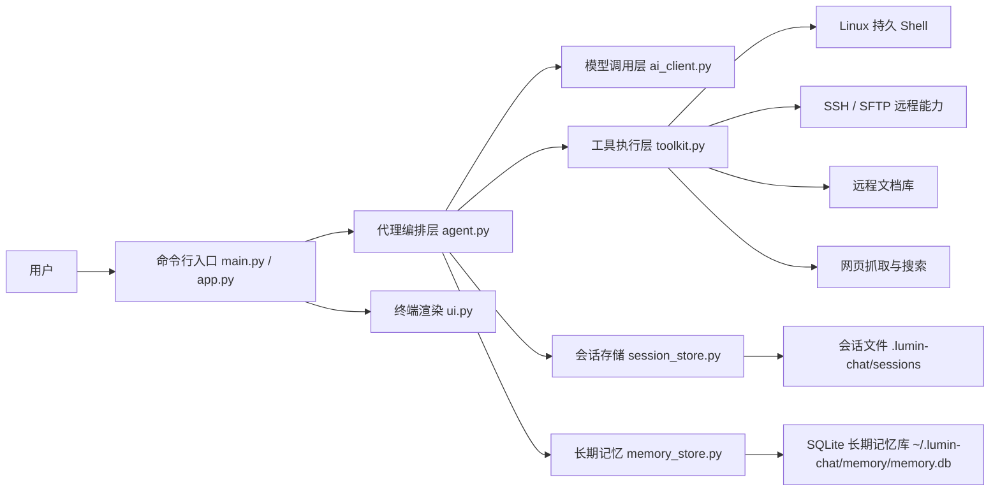
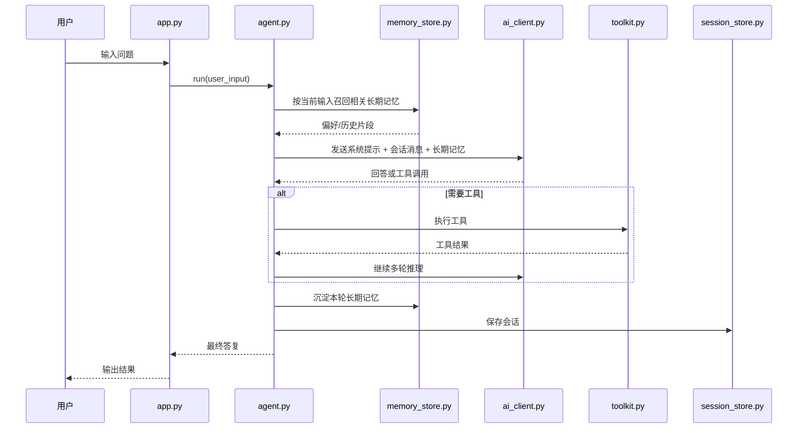
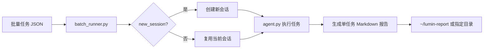
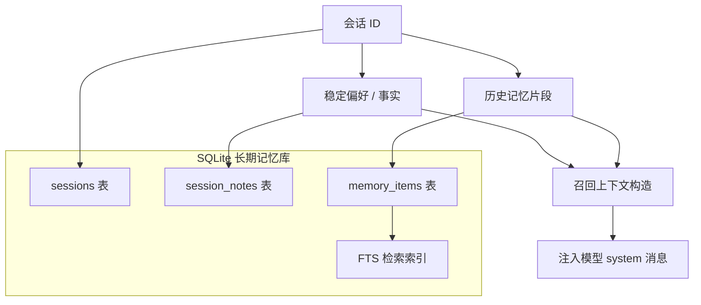
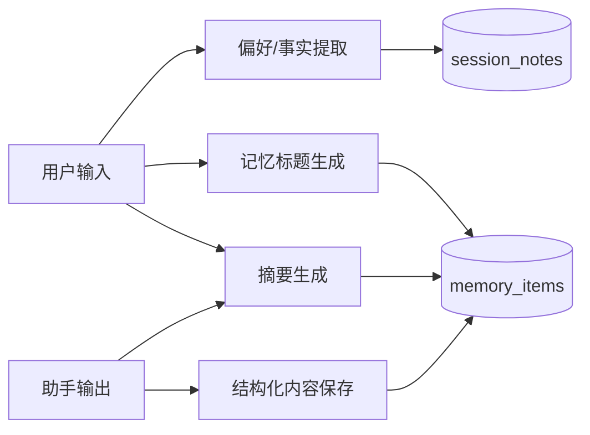
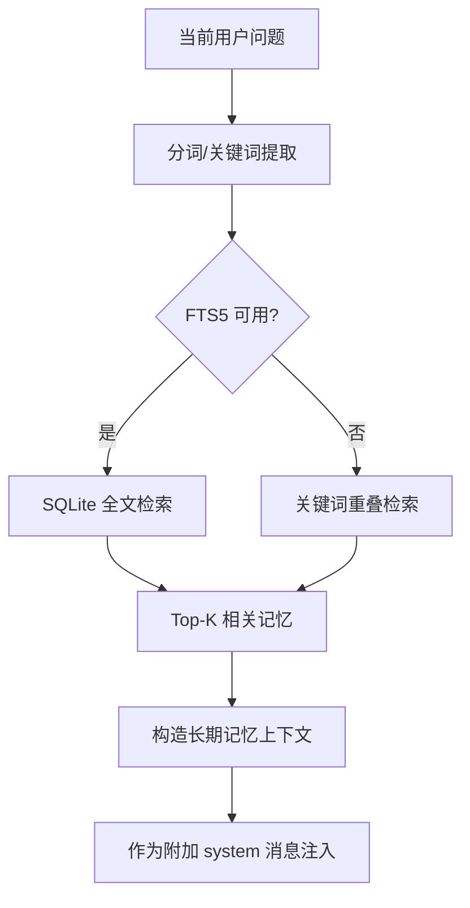
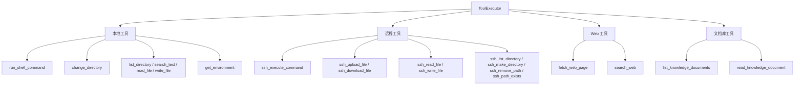
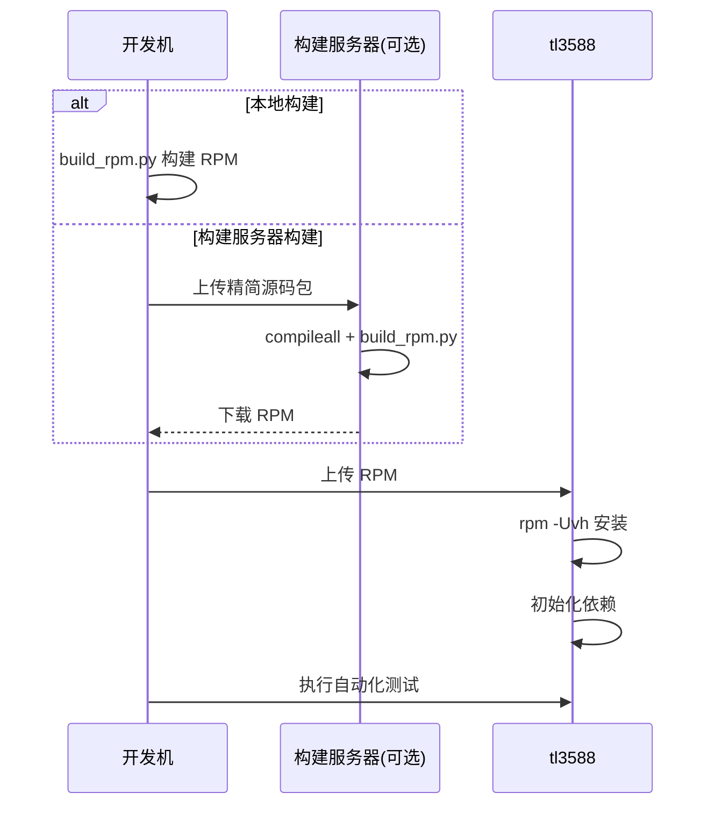
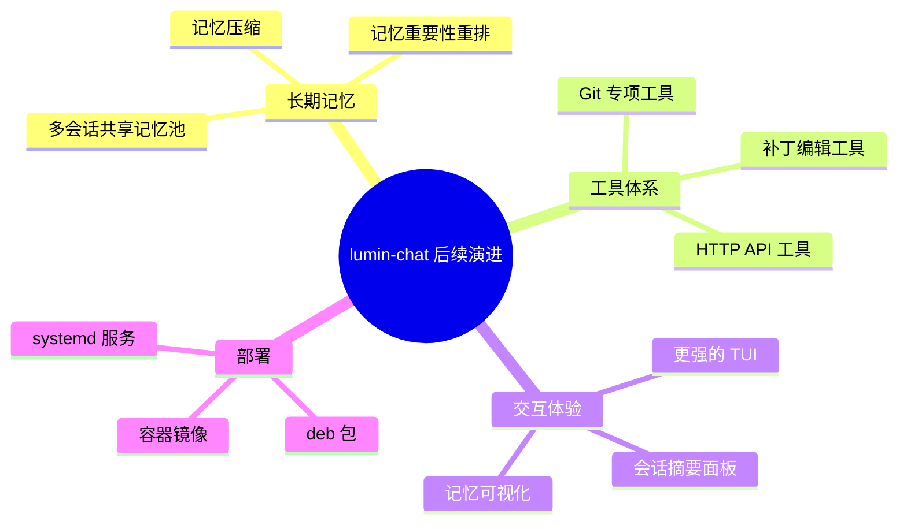

# lumin-chat 设计文档

## 1. 文档目标

本文档用于说明 lumin-chat 的整体架构、关键模块、长期记忆方案、部署打包流程与测试策略。文档面向发布版本，重点说明：

- 系统整体结构
- 对话执行链路
- 会话长期记忆设计
- 工具体系设计
- RPM 打包与部署路径
- 测试与发布策略

---

## 2. 系统总体框图



### 2.1 分层说明

1. **CLI 层**：负责参数解析、交互输入和 Slash Command。
2. **代理层**：负责多轮对话、工具调用编排、自动升模和长期记忆召回。
3. **工具层**：负责 Shell、SSH、Web、文件、文档库等实际执行能力。
4. **存储层**：分为会话存储和长期记忆存储两部分。
5. **批处理层**：负责读取 JSON 任务文件、控制会话切换、逐任务生成报告。

---

## 3. 对话执行时序



### 3.1 关键点

- 长期记忆不是替代会话上下文，而是作为额外检索层。
- 当前轮用户输入会触发一次长期记忆召回。
- 最终完成后会把本轮输入输出沉淀进长期记忆库。
- 每次发给模型时都会额外注入当前主机基础信息，如 `/etc/os-release` 与 `uname -a`，帮助模型做出更准确判断。

---

## 3.2 批量任务执行设计



批处理遵循以下原则：

- 输入为 JSON 数组，每一项至少包含 `task`
- `new_session` 默认值为 `true`
- 单个任务失败只记录到对应报告，不中断后续任务
- 每个任务都生成独立 Markdown 报告，便于归档与追溯

---

## 4. 长期记忆设计

用户要求“每个会话都要有长期记忆”。因此本项目采用了**会话级长期记忆**设计：

- 每个会话使用独立 `session_id`
- 长期记忆按 `session_id` 隔离存储
- 会话恢复后可继续使用该会话的长期记忆
- 新建会话后会自动建立新的长期记忆空间
- 切换会话时，会同时切换到该会话对应的长期记忆空间
- 旧会话长期记忆不会因新建会话而被清空

### 4.1 长期记忆总体结构



### 4.2 为什么采用 SQLite + 会话级检索

采用该方案的原因：

1. **内置依赖少**：SQLite 是 Python 标准库内置能力，无需外部服务。
2. **适合本地和板卡环境**：无需部署向量数据库，适合 tl3588 这类设备。
3. **可恢复**：会话结束后记忆不会丢失。
4. **可检索**：支持 FTS5 时使用全文检索，不支持时自动回退到关键词重叠匹配。
5. **隔离性强**：每个会话拥有独立长期记忆，不会互相污染。

### 4.3 长期记忆沉淀策略



沉淀时做两类处理：

#### A. 稳定偏好/事实

例如：

- 默认测试板是 `tl3588`
- 优先使用 RPM 部署
- 配置文件优先读取 `/etc/lumin-chat/config.json`
- 偏好中文输出

这些内容会写入 `session_notes`，在后续召回时优先注入。

#### B. 历史记忆片段

每轮对话会生成：

- 标题
- 摘要
- 完整输入输出 JSON
- 关键词
- 重要性评分

这些内容写入 `memory_items`，供后续按当前问题检索。

### 4.4 长期记忆召回策略



召回输出包含两部分：

- 稳定偏好/事实
- 与当前问题最相关的历史记忆片段

这样可以兼顾“记住长期偏好”和“记住历史结论”。

---

## 5. 工具体系设计

### 5.1 工具分类框图



### 5.2 工具设计原则

- 能直接用一两条简单 Linux 命令替代的，不优先抽成复杂工具。
- 需要稳定封装、跨环境复用、对模型更友好的能力，优先做工具化。
- SSH 文件管理、网页抓取、文档库读取都符合“难以让模型稳定直接拼命令”的场景，因此适合做工具。

---

## 6. 中文终端交互设计


### 6.1 设计原因

普通 `input()` 在复杂终端、中文输入法、删除键和方向键场景下稳定性较差，因此项目改为：

- `prompt_toolkit` 负责交互输入
- `sys.stdin/stdout/stderr.reconfigure()` 统一设置 UTF-8
- Rich 负责渲染输出

目标是：

- 中文输入尽量不乱码
- Backspace/Delete 正常
- 方向键与历史记录正常

---

## 7. RPM 打包与部署设计

### 7.1 安装布局

```mermaid
flowchart TB
    RPM[lumin-chat.rpm] --> ETC[/etc/lumin-chat/config.json]
    RPM --> BIN[/usr/bin/lumin-chat]
    RPM --> LIB[/var/lib/lumin-chat]
    LIB --> SRC[源码与脚本]
    LIB --> DOCS[文档]
    LIB --> VENV[.venv 或 vendor 依赖目录]
```

### 7.2 路径设计原因

- `/etc/lumin-chat/config.json`：系统级配置，便于统一管理。
- `/usr/bin/lumin-chat`：提供稳定启动入口。
- `/var/lib/lumin-chat`：保存源码、脚本、文档与运行依赖。

### 7.3 部署流程



---

## 8. 关键模块职责

| 模块 | 作用 |
|---|---|
| `main.py` | 程序入口 |
| `src/app.py` | CLI 参数、交互循环、Slash Command |
| `src/agent.py` | 多轮代理、记忆召回、工具编排、自动升模 |
| `src/memory_store.py` | 长期记忆持久化与检索 |
| `src/session_store.py` | 会话 JSON 持久化 |
| `src/toolkit.py` | 工具注册与执行 |
| `src/ssh_client.py` | SSH / SFTP 封装 |
| `src/web_tools.py` | 网页抓取与搜索 |
| `src/config_loader.py` | 配置加载与系统配置覆盖 |
| `scripts/build_rpm.py` | RPM 构建 |
| `deploy.py` | 本地/远端构建、部署与测试 |

---

## 9. 测试设计

### 9.1 本地测试范围

- Python 语法编译检查
- `scripts/smoke_test.py`
- RPM 构建测试
- SSH 工具回退链路测试
- 长期记忆存储与召回测试

### 9.2 tl3588 测试范围

- RPM 安装状态
- `/etc/lumin-chat/config.json` 存在性
- `/usr/bin/lumin-chat --help`
- `scripts/smoke_test.py`
- Docker Ubuntu 非交互测试
- 构建服务器流程回归测试
- 长期记忆逻辑验证

---

## 10. 发布态要求

发布版本目录遵循以下原则：

- 必须包含 `README.md`
- 必须包含中文设计文档
- 安装包中不再打入 `reports/` 等测试生成物
- 仅保留运行必须文件、脚本和文档
- 长期记忆目录在首次运行时自动创建，不依赖预置文件

---

## 11. 后续可扩展方向



当前实现已经满足“会话级长期记忆 + Linux 终端代理 + SSH 远程能力 + RPM 发布 + 测试板验证”的发布要求。
